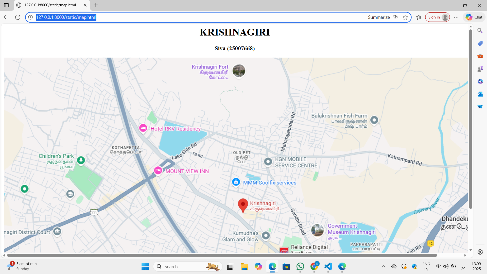

# Ex03 Places Around Me
## Date: 30-11-2025

## AIM
To develop a website to display details about the places around my house.

## DESIGN STEPS

### STEP 1
Create a Django admin interface.

### STEP 2
Download your city map from Google as an image.

### STEP 3
Insert the image using `````` tag and link it to the map.

### STEP 4
Using ```<map>``` tag name the map.

### STEP 5
Create clickable regions in the image using ```<area>``` tag.

### STEP 6
Write HTML programs for all the regions identified.

### STEP 7
Execute the programs and publish them.

## CODE
```
<html>
    <head align="center">
       <h1 align="center"> KRISHNAGIRI </h1>
       <h3 align="center">Siva (25007668)</h3> 
       

<map name="image-map">
    <area target="" alt="childeren's park" title="childeren's park" href="park.html" coords="81,268,277,373" shape="rect">
    <area target="" alt="mount view inn" title="mount view inn" href="mount.html" coords="585,358,119" shape="circle">
    <area target="" alt="Goverment Museum" title="Goverment Museum" href="museum.html" coords="944,487,1059,420,1193,521,1193,633,959,624" shape="poly">
    <area target="" alt="KGN mobile " title="KGN mobile " href="mobile.html" coords="799,274,1011,362" shape="rect">
    <area target="" alt="Balakrishnan Fish Farm" title="Balakrishnan Fish Farm" href="fish.html" coords="1080,163,118" shape="circle">
</map>
       
    </head>
    <body>

    </body>
</html>

```
MOBILE.HTML
<html>
    <body bgcolor="pink">
        <h1 align="center">Krishnagiri</h1>
        <br>
        <h2 align="center">KGN Mobile</h2>
        <hr>
        <h3>KGN Mobiles in Krishnagiri is a mobile phone retail store with a location on Bangalore Main Road and another in Bargur. The main store is open daily from 9 AM to 9:30 PM and offers a wide selection of products and services, including price protection, one-time screen replacement, and various payment options</h3>

    </body>
</html>
```
fish.html
<html>
    <body bgcolor="red">
        <h1 align="center">KRISHNAGIRI</h1>
        <br>
        <h2 align="center">balakrishna fish farn</h2>
        <hr>
        <h3>Balakrishnan Fish Farm is a local fish shop and potentially a farm located in Krishnagiri, Tamil Nadu, known for selling fresh fish.</h3>

    </body>
</html>
```
mountain.html
 
 <html>
    <body bgcolor="purple">
        <h1 align="center">Krishnagiri</h1>
        <br>
        <h2 align="center">MOUNTAIN</h2>
        <hr>
        <h3>Krishnagiri Fort is a historical fortress built by the Vijayanagar Empire, known for its strong defenses and location on a hill in Krishnagiri, Tamil Nadu</h3>

    </body>
</html>
```
museum.html


<html>
    <body bgcolor="pink">
        <h1 align="center">KRISHNAGIRI</h1>
        <br>
        <h2 align="center">MUSEUM</h2>
        <hr>
        <H3>The Government Museum in Krishnagiri, Tamil Nadu, is a tourist attraction that showcases the history and culture of the region through its collection of artifacts, including hero stones, BC tools, and terracotta objects
    
        </H3>
    </body>
</html>    
   ```
   park.html

   <html>
    <body bgcolor="purple">
        <h1 align="center">Krishnagiri</h1>
        <br>
        <h2 align="center">children's park</h2>
        <hr>
        <h3>The Children's Park in Krishnagiri is a family-friendly destination, located in Avathanapatti, with play areas for children, including swings and slides, and a grassy, well-maintained area for relaxation</h3>

    </body>
</html>
```

## OUTPUT

map.html



mount.html


MOBILE.HTML


fish.html


museum.html


park.html


## RESULT
The program for implementing image maps using HTML is executed successfully.
